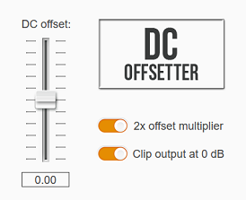

# DCOffsetter

DCOffsetter is an audio effect plugin that applies a variable DC offset to an audio signal.



This project utilizes Steinberg's [VST 3 SDK](https://github.com/steinbergmedia/vst3sdk) and [VSTGUI 4](https://github.com/steinbergmedia/vstgui).

## Installation

The pre-built plugin can be downloaded from the "Release" section. Execute the following steps if you want to build the project and plugin yourself (on Windows w/ Visual Studio):

1. Make sure that you have set up the VST 3 SDK, VSTGUI 4 and [CMake](https://cmake.org/).

2. Run the following commands to build the project:
   ```shell
   mkdir build
   cd build
   cmake -G "Visual Studio 17 2022" -DVST3_SDK_ROOT=/path/to/VST_SDK/vst3sdk/ ..
   ```

3. Run the following command to build the plugin:
   ```shell
   cmake --build . --config Release
   ```
   Alternatively, you can use Visual Studio to build a debug version, which enables the UI editor. The build outputs will be stored in `build/VST3/Debug` and `build/VST3/Release`.

4. To use the plugin in a host application, copy the .vst3 package to your VST3 folder.
